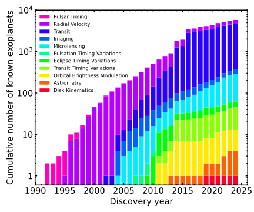
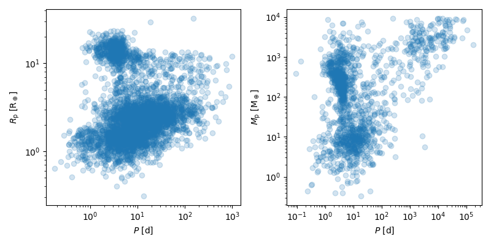

# Exoplanet Inventory

These plots are useful for illustrating information in connection with the inventory of known exoplanets. I want to be somewhat particular about where this information is coming from, and how it is displayed (to make sure it is easy to understand the plots). For both plots, I use the [NASA Exoplanet Archive](https://exoplanetarchive.ipac.caltech.edu/) and its TAP functionality (more or less, out of habit).

## Exoplanet detection statistics

This is the cumulatively known number of exoplanets, split by the technique used to detect and confirm each planet. This plot still has some issues I want to work out: 

1. The colour-scheme is more or less horrendous: The two shades of green are not really distinguishable.
2. It is unfortunate that I have to use a log-scale on the y-axis a trade-off between legibility (otherwise the first few years of detection would not be visible) and emphasis (naturally the log-scale emphasises smaller numbers more, and has to arbitrarily be extended below 1, as it cannot show a zero-line).

I'm thinking of possibly doing something additional like a line-plot for each method, but I still have to test this.

## Exoplanet population parameters

This is still being worked on. I've not yet decided what a good default plot for this rather big collection of information could be - both radius and mass are important for different purposes, and not all planets have measurements for both parameters. Additionally, there are some really odd outliers in both parameter spaces (like super long-period objects, or really tiny planetesimals) that would skew the plots if they are not excluded (which needs to be notes in both cases, obviously).

It might also be an interesting idea to colour-code the detection techniques in these plots, although the radius parameter space will be dominated by transits I am assuming, and the mass parameter space by radial velocity measurements. 

Lastly, a general outline of "planet types" might also be of interest, such as a box / circle for hot Jupiters, sub-Neptunes, super-Earths, and "normal" Jupiters.

