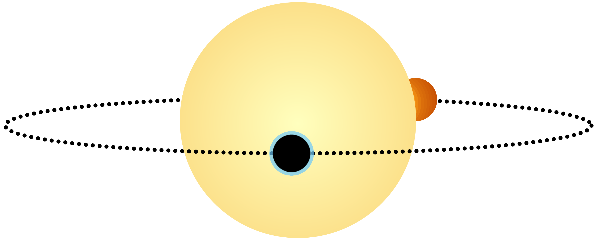

# Phase-curve Cartoon

I made this illustration in [Krita](https://krita.org/en/) because I got sick of either always looking for a high-resolution version of these plots, or struggling to remove labels from existing ones.

I can see this being extended with some additional markers on the figure, a better version of the "atmosphere" in the primary transit (e.g. a transparency-gradient circle), or maybe a more consistent "hot dayside" for the secondary eclipse. Additionally, one or two more phases on the orbit might be nice.
