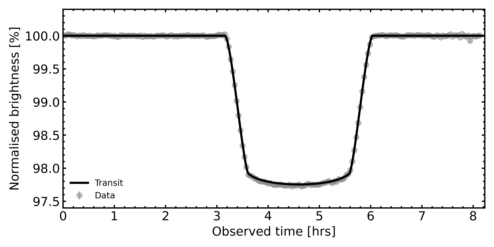
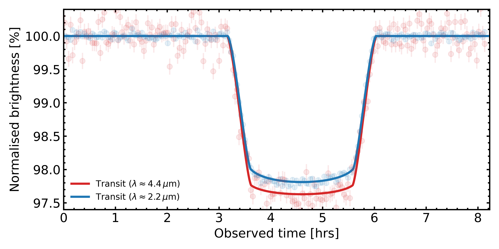

# Transit Light-Curve examples

These are really simple illustrations, and they are very case-dependent, but I often look for visually identifiable illustrations of transit light-curves. The data used to generate these is from a data-reduction run I did on the NIRSpec WASP-39 b data set as part of my PhD work, but it could in principle be substituted with any other data set.

Both the spectroscopic, and the integrated white light-curve have binning factors associated with them (in time). For the spectroscopic curves, this binning is rather necessary, as the scatter is very big otherwise. The size of the temporal bins is noted within the name of the files.

Additionally, all light-curve treatment uses variance-weighted temporal binning. For a bin size of 100 (as in the example), only the long-wave spectroscopic light-curve has error bars still visible in the binned case (which makes sense, since the spectral resolution significantly rises towards this region).